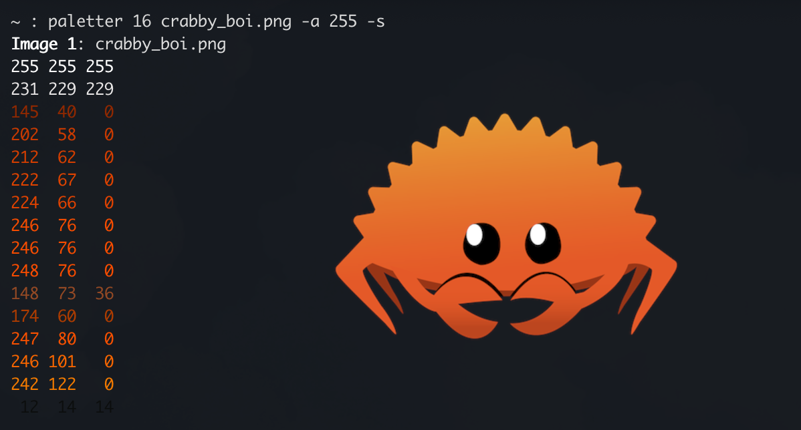

## Paletter
A super simple command-line palette quantizer.

**Example**: Generating a 16-colour palette of [Ferris](https://rustacean.net/):
<p align="center">
  
</p>

## Installation
[Download precompiled binaries here](https://github.com/edobrowo/paletter/releases). Thanks [cargo-dist](https://opensource.axo.dev/cargo-dist/) :)

## Usage
To generate a palette, simply specify the palette size and an image path.
```sh
paletter -p 256 -f "/path/to/your/image.png"
```

You can generate a palette for any number of images.
```sh
paletter -p 1024 -f "image1.png" "image2.jpg" "image3.webp"
```

Paletter supports decimal RGB and hexadecimal display formats. RGB is the default display mode.
```sh
paletter -p 256 -f "image.png" --rgb --hex --uncolored
```

An alpha channel threshold can be specified to prevent transparent values from counting toward the palette. This is useful in quantizing images with transparent backgrounds.
```sh
paletter -p 16 -f "image.svg" --alpha-thresh 255
```

The output can be left unsorted or sorted by HSV. The colored output can be disabled.
```sh
paletter -p 256 -f "image.jpg" --rgb --sort --uncolored
```

## Details
Paletter applies [median cut](https://en.wikipedia.org/wiki/Median_cut) to reduce the image color space.
